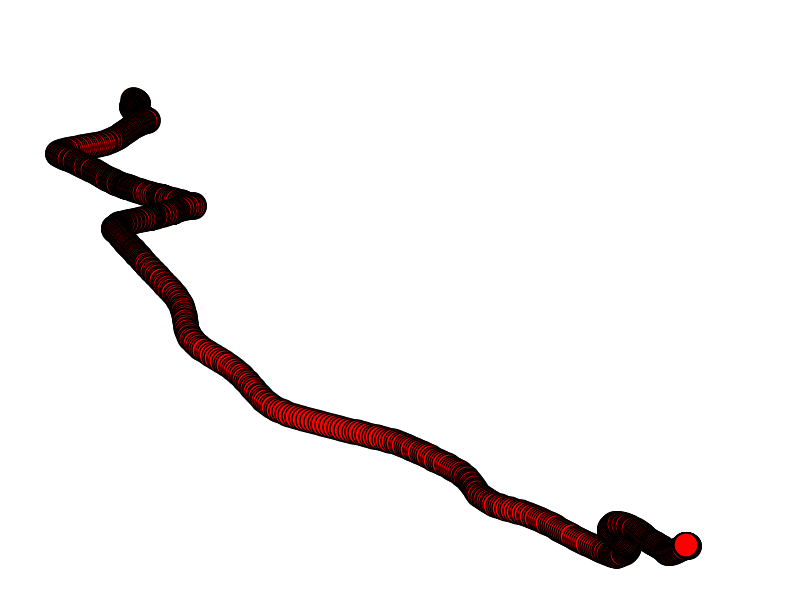

# Solving Driver Telematics Analysis using Neural Networks
 
##Problem Statement

We are given 200 routes taken by each of the x drivers. Each route is represented as a sequence of ```x,y``` coordinates that represent measurements of a driver's GPS location sampled every second. Coordinates start at point ```0,0``` and are in meters so a driver that is first at ```2,3``` and then moves to  ```3,3``` has moved a total of 3 meters. [Download data here](https://www.kaggle.com/c/axa-driver-telematics-analysis/data)

Given a new trip, the task is to identify trips which are not from the driver of interest based on their telematic features. The expected output is the predicted probability of the trip belonging to the driver of interest.

##Setting up the tools

I started with a free version of EC2 and setup the required dependencies for Theano, Pylearn2 and IPython. Since I unfortunately don't own a GPU at home, I instead expect to take advantage of AWS for this as well.

```
sh setup.sh
```

Then to make sure that Theano libraries were properly imported and that it can detect the GPU I ran the two below scripts.

```
python configuration-testing/working.py

python configuration-testing/gpu-check.py
```

##Idea 1: Encoding a trip

A trip is given to us as a sequence of  ```x,y``` pair of coordinates this describes a path in a 2D plane. It is therefore possible to turn our text data into image data and feed it into a convolutional neural network.

We do this using the networkx library


